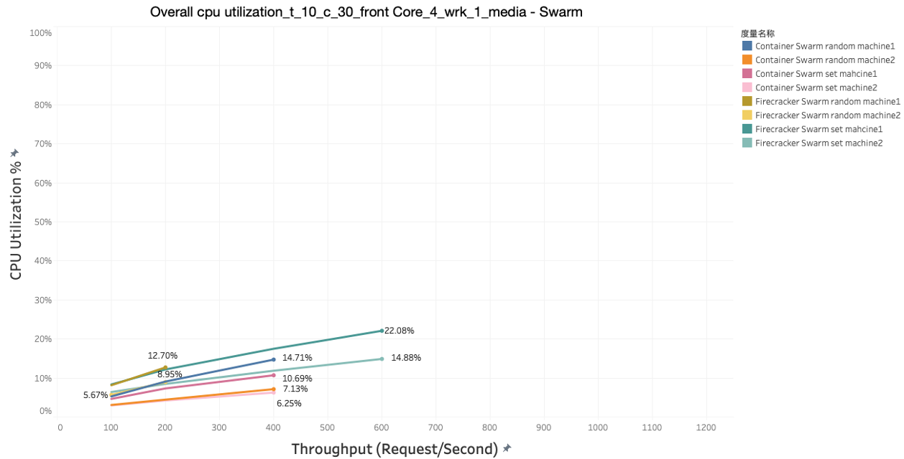
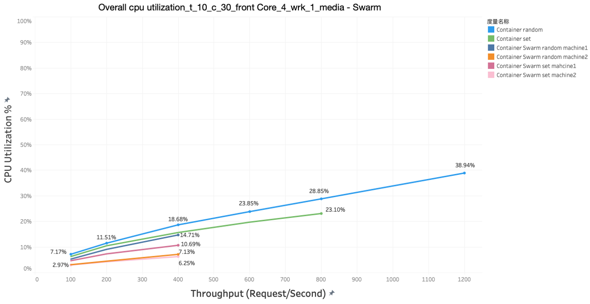
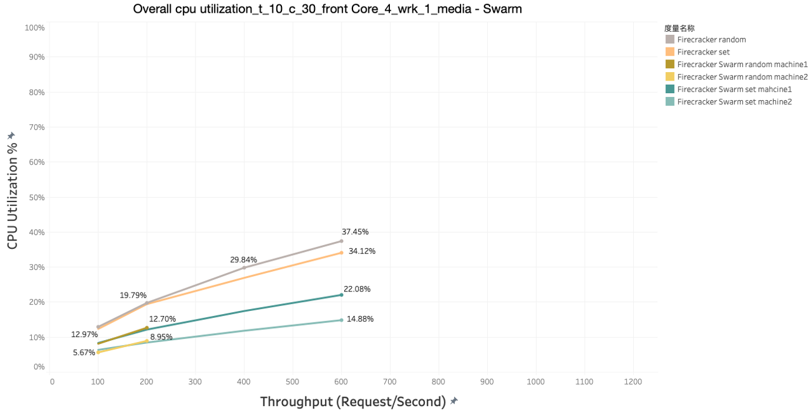
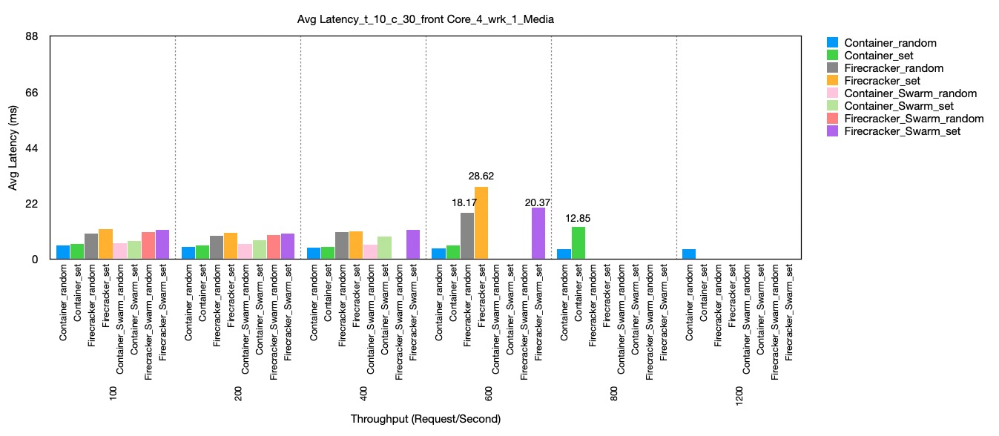
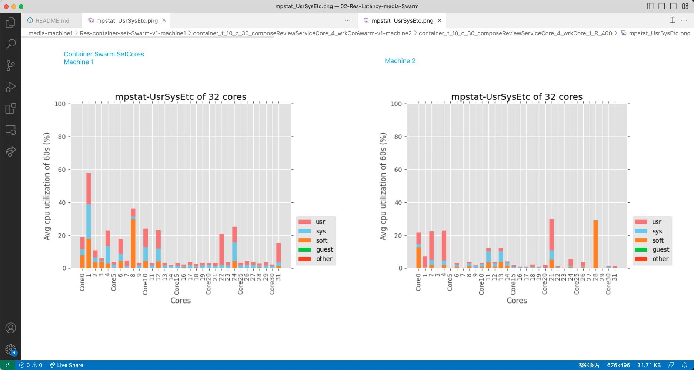
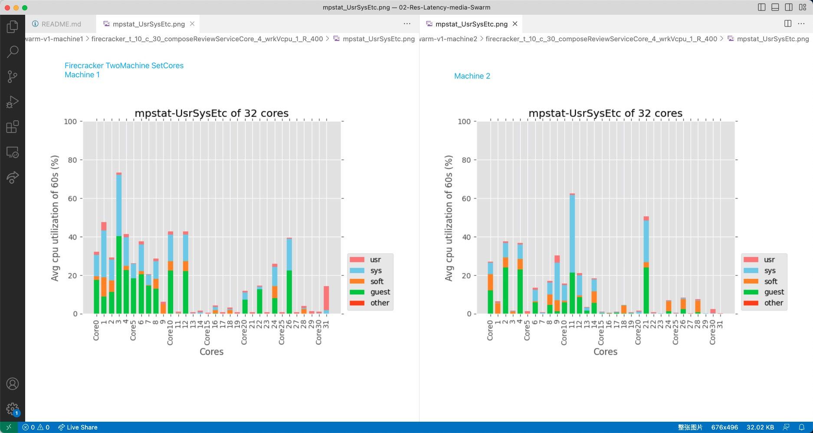

# Media Microservices Swarm
Total 33 containers, 32 firecrackers

let 30 firecrackers, each set to different one core, from core 0,2,4,6,8…….30 AND 17, 19, 21

let firecracker media-microservice-compose-review-memcached set to core 23, 25

set social-network-compose-post-service to core 1 or above (basically core 1,3,5，7)

set wrk to core 31

## Overall CPU Excel
Can see the overall CPU utilization, throughtput, BW etc. in this excel [02 - Latency of MediaMicroservices Swarm ](https://docs.google.com/spreadsheets/d/1KipZ43JScKEp5h5mVUZfuVkJqZ-6gj9VnuggwYaOQyM/edit#gid=1045338351).

## Overall Cpu Utilization
Overall cpu utilization comparison,under the condition: t_10_c_30_frontCore_4_wrk_1, different -R, according to the data in the upper excel [02 - Latency of MediaMicroservices Swarm ](https://docs.google.com/spreadsheets/d/1KipZ43JScKEp5h5mVUZfuVkJqZ-6gj9VnuggwYaOQyM/edit#gid=1045338351)

Cpu utilization of all the swarm data: container swarm + firecracker swarm

Cpu utilization of all the container data:

Cpu utilization of all the firecracker data:

## Avg Latency
Avg Latency comparison,under the condition: t_10_c_30_frontCore_4_wrk_1, dirrerent -R, according to the data in the upper excel [02 - Latency of MediaMicroservices Swarm ](https://docs.google.com/spreadsheets/d/1KipZ43JScKEp5h5mVUZfuVkJqZ-6gj9VnuggwYaOQyM/edit#gid=1045338351)

## Mpstat-UsrSysEtc
The mpstat result,under the condition: t_10_c_30_frontCore_4_wrk_1, -R 400, compare the UsrSysEtc result of "container set" in machine 1 and machine 2

The mpstat result,under the condition: t_10_c_30_frontCore_4_wrk_1, -R 400, compare the UsrSysEtc result of "firecracker set" in machine 1 and machine 2

## VMs - Corresponding cores, master machine
* media-microservice-unique-id-service \ -—-—------------------------ core 0
* media-microservice-text-service \ -—-—----------------—------------ core 2
* media-microservice-rating-service \ -—-—----------------—---------- core 4
* media-microservice-user-service \ -—-—----------------—------------ core 6
* media-microservice-review-storage-service \ -—-—------------------- core 8
* media-microservice-user-review-service \ -—-—---------------------- core 10
* media-microservice-movie-review-service \ -—-—--------------------- core 12

* media-microservice-cast-info-service  -—-—------------------------- core 14
* media-microservice-movie-info-service  -—-—------------------------ core 16
* media-microservice-plot-service  -—-—----------------—------------- core 18

* media-microservice-jaeger \ -—-—----------------—------------------ core 20,22（R-800隔一段时间会很多，改成2个了，其实R小的话，不用那么多）
* media-microservice-movie-id-service \ -—-—------------------------- core 24,26
* media-microservice-compose-review-service \ -—-—------------------- core 1, 3, 5, 7(container swarm时候，只有2个PID SPID,设置到了core 1, 7上)

## VMs - Corresponding cores, secondary machine

* media-microservice-review-storage-mongodb \ -—-—----------------—-- core 0
* media-microservice-user-review-mongodb \ -—-—----------------—----- core 2
* media-microservice-movie-review-mongodb \ -—-—----------------—---- core 4
* media-microservice-rating-redis \ -—-—----------------—------------ core 6
* media-microservice-movie-review-redis \ -—-—----------------—------ core 8
* media-microservice-user-review-redis \ -—-—------------------------ core 10
* media-microservice-movie-id-memcached \ -—-—----------------—------ core 12 (后加的)
* media-microservice-user-memcached \ -—-—-----------------—--------- core 14 (后加的)
* media-microservice-review-storage-memcached  -—-—------------------ core 16
* media-microservice-cast-info-memcached  -—-—----------------—------ core 18
* media-microservice-plot-memcached  -—-—---------—------------------ core 20
* media-microservice-movie-info-memcached  -—-—----------------—----- core 22
* media-microservice-movie-id-mongodb  -—-—-------------------------- core 24
* media-microservice-user-mongodb  -—-—-----------—------------------ core 26
* media-microservice-cast-info-mongodb  -—-—------------------------- core 28

* media-microservice-plot-mongodb  -—-—----------------—------------- core 17
* media-microservice-movie-info-mongodb  -—-—------------------------ core 19
* media-microservice-nginx-web-server \ -—-—------—------------------ core 21(没法给多，会崩溃,/core给24， 26能跑28秒左右)
* media-microservice-compose-review-memcached \ -—-—---------—------- core 9,11,13,15

## There is little different from set cores
- Container has 33 vms(container mediamicroservices-dns-media-1), firecracker has 32 vms

## Generation Scrpts：
* test-CPU-randomCore-grayfox-latency-firecracker-swarm
* test-CPU-oddEvenCore-grayfox-latency-firecracker-swarm

## Data
* Res-container-set-Swarm-v1
* Res-container-random-Swarm-v1
* Res-firecracker-set-Swarm-v1
* Res-firecracker-random-Swarm-v1

## Difference of Swarm and non-Swarm
* Swarm mode set vms to 2 machines / ori container test only on one machine
* Swarm don't have vms set to one same core 
* Swam record the BW of the physical network card 
