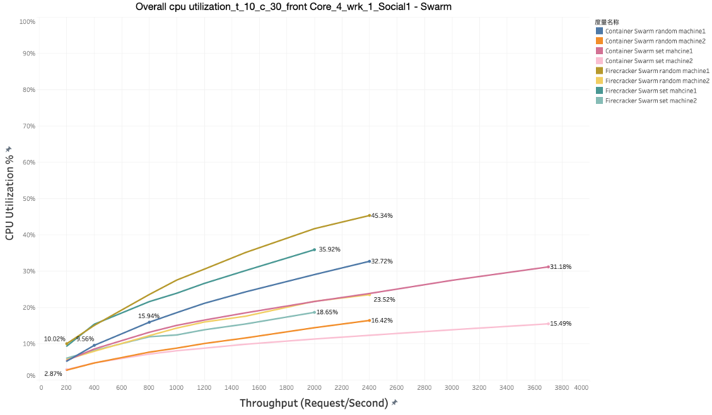
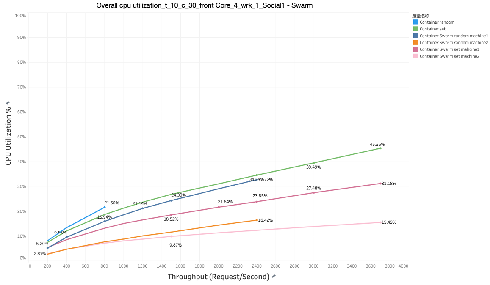
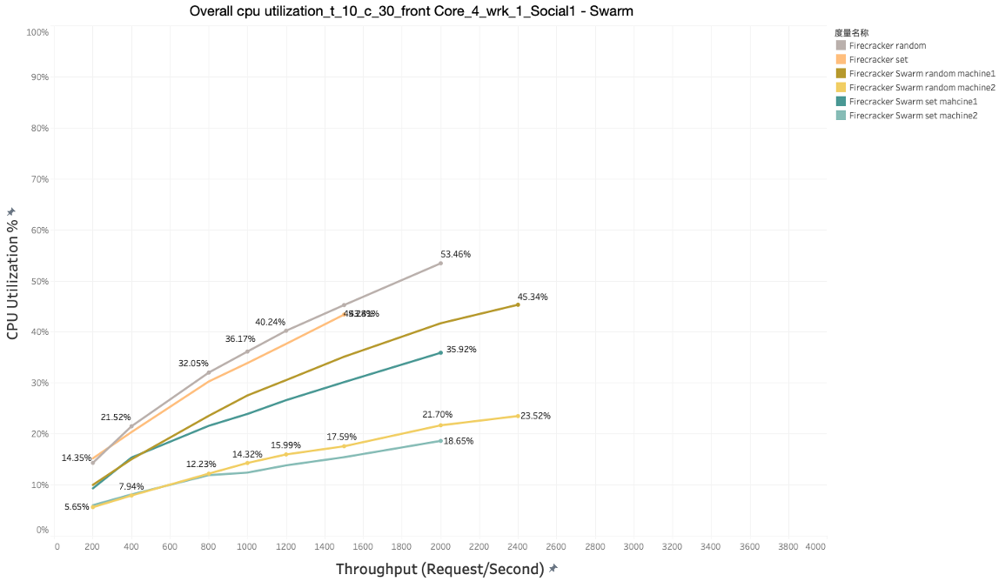
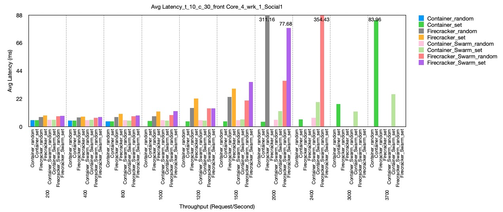
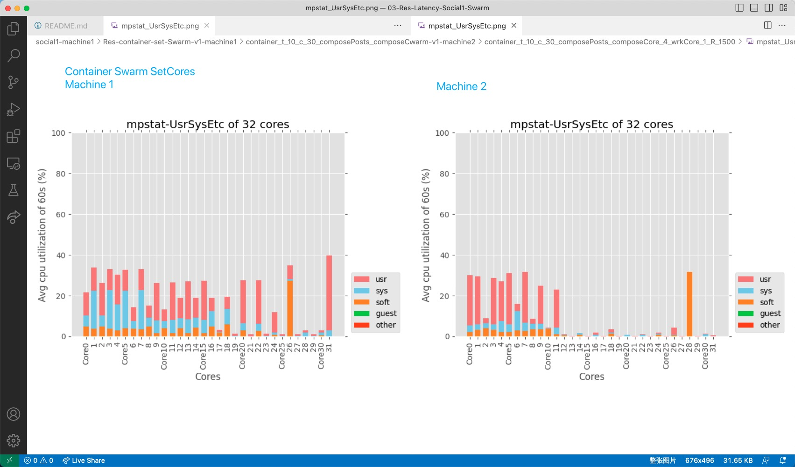
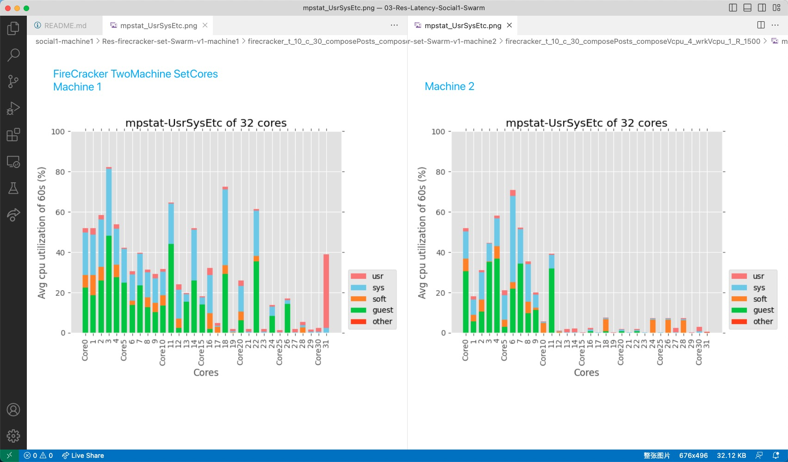

# Social Network
## Random core

Total have 27 containers.

Total 27 firecrackers on one machine. 

Swarm have 31 container services. (4 more containers than others, total have: social_jaeger-query, social_jaeger-collector,social_cassandra-schema, social_cassandra).

Total 27 firecrackers on two machines.

let 26 firecrackers, each set to different cores, from core 0,2,4,6,8…….30 AND 17, 19, 21, 23 ... 29

set social-network-compose-post-service to core 1 or above (basically core 1,3,5-more-7)

set wrk to core 31

This time not set to specific cores, just limit the number of cores!!

## Overall CPU Excel
Can see the overall CPU utilization, throughtput, BW etc. in this excel [03 - Latency of SocialNetwork1 Swarm ](https://docs.google.com/spreadsheets/d/1cVVgBsQXYFdK8wWYeFSkCXTaK7Lk_UoXT8pRVRz7Vhw/edit#gid=1045338351).

## Overall Cpu Utilization
Overall cpu utilization comparison,under the condition: t_10_c_30_frontCore_4_wrk_1, different -R, according to the data in the upper excel [03 - Latency of SocialNetwork1 Swarm ](https://docs.google.com/spreadsheets/d/1cVVgBsQXYFdK8wWYeFSkCXTaK7Lk_UoXT8pRVRz7Vhw/edit#gid=1045338351)

Cpu utilization of all the swarm data: container swarm + firecracker swarm

Cpu utilization of all the container data:

Cpu utilization of all the firecracker data:

## Avg Latency
Avg Latency comparison,under the condition: t_10_c_30_frontCore_4_wrk_1, dirrerent -R, according to the data in the upper excel [03 - Latency of SocialNetwork1 Swarm ](https://docs.google.com/spreadsheets/d/1cVVgBsQXYFdK8wWYeFSkCXTaK7Lk_UoXT8pRVRz7Vhw/edit#gid=1045338351)

## Mpstat-UsrSysEtc
The mpstat result,under the condition: t_10_c_30_frontCore_4_wrk_1, -R 1500, compare the UsrSysEtc result of "container set" in machine 1 and machine 2

The mpstat result,under the condition: t_10_c_30_frontCore_4_wrk_1, -R 1500, compare the UsrSysEtc result of "firecracker set" in machine 1 and machine 2

## VMs - Corresponding cores, master machine
* social-network-social-graph-service \ --------------------—---------- core 0
* social-network-post-storage-service \ ------------------------------- core 2
* social-network-url-shorten-service \ ------------------------------- core 4
* social-network-media-service \ -------------------------------------- core 6
* social-network-user-service \ --------------------------------------- core 8
* social-network-unique-id-service \ ---------------------------------- core 10

* social-network-user-timeline-service \ ------—-----—----------------- core 12,14
* social-network-user-mention-service \ ------—-----—-----—------------ core 16,18
* social-network-home-timeline-service \ ------—-----—----------------- core 20,22
* social-network-jaeger-agent \ -—-—----------------—------------------ core 24, 26 
* social-network-text-service \ ------------—-----—-----—-----—-------- core 9,11,13,15（4个用处似乎不大,但是看数值37%，70% 29% 28%感觉还是有用的）(container swarm时候，只有2个PID SPID,设置到了core 9, 15上)
* social-network-compose-post-service \ ---—----------------------- core 1, 3, 5,-more- 7(container swarm时候，只有2个PID SPID,设置到了core 1, 7上)(~~这个到了bottleneck，除非wrk开始后重新set cores/无法这么操作，原因1:因为spid数目是变化的一会140多后面会变少70多啥的，到最后wrk结束又回到2个；原因2，就算均匀给4个，core 3会很多还是几乎满，其他几乎没有~~）

wrk 31

Swarm have 3 more vms on machine one
* social_jaeger-query \ ------------—-----—-----—-----—------—--------- core 17
* social_jaeger-collector \ ------------—-----—--------—-----—--------- core 19, 21, 23, 25
* social_cassandra-schema \ ------------—-----—-----—---------—-------- core 21(stopped所以不set了)

## VMs - Corresponding cores, secondary machine
* social-network-home-timeline-redis \ -——-—--------------------------- core 0
* social-network-user-timeline-redis \ —-----------------—------------- core 2
* social-network-post-storage-mongodb \ ----------------—-------------- core 4
* social-network-user-memcached \ ----------—-----—-----—-------------- core 6
* social-network-social-graph-redis \ —-------------------------------- core 8
* social-network-post-storage-memcached --—---------------------------- core 10
* social-network-url-shorten-memcached ---—---------------------------- core 12
* social-network-media-memcached ---—---------------------------------- core 14
* social-network-social-graph-mongodb ---—----------------------------- core 16
* social-network-user-mongodb ---—------------------------------------- core 18
* social-network-media-mongodb ---—------------------------------------ core 20
* social-network-media-frontend ---—---------------------------------- core 22

* social-network-user-timeline-mongodb \ ------—------------—---------- core 1,3 (27%.52%好像可以合并的,算了，加起来也80～90%了)
* social-network-nginx-thrift \ ------------—-----—-----—-------------- core 5,7 (nginx webserver吗)
* social-network-url-shorten-mongodb \ -------------------—------------ core 9, 11 （这个其实后面好像还会变成bottleneck的但是没办法，没有更多的core了）

Swarm have 1 more vm on machine two
* social_cassandra \ ------------—-----—-----—-----—------—------------ core 13, 15, 17, 19, 21, 23

## Generation Scrpts：
* test-CPU-randomCore-grayfox-latency-firecracker-swarm
* test-CPU-oddEvenCore-grayfox-latency-firecracker-swarm

## Data
* Res-container-set-Swarm-v1
* Res-container-random-Swarm-v1

## Difference of Swarm and non-Swarm
* Swarm mode set vms to 2 machines / ori container test only on one machine
* Swarm don't have vms set to one same core 
* Swam record the BW of the physical network card 

## There is little different from set cores
- In oddEvenCore set condition:
    - social-network-post-storage-memcached
    - social-network-url-shorten-memcached
    - social-network-media-memcached
    - social-network-social-graph-mongodb
    - social-network-user-mongodb
    - social-network-media-mongodb
    - social-network-media-frontend
    
    All set to only one core - core 14

- In oddEvenCore set condition:
    - social-network-social-graph-redis
    - social-network-media-service

All set to only one core - core 12

- In randomCore condition:
    - upper vms are each set to at most --cpus 1