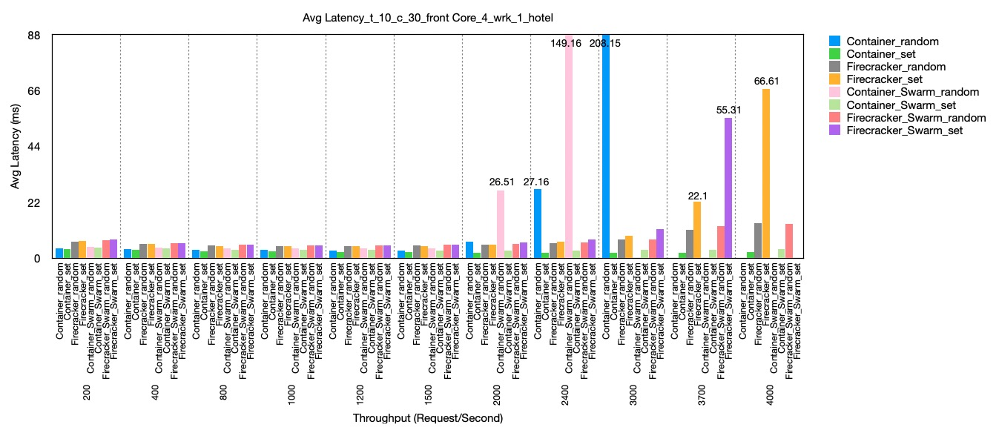

# Hotel Reservation Data - Swarm

let 18 firecrackers, each set to different cores, from core 0,2,4,6,8…….20

set frontend to core 1 or above (basically core 1,3,5-more-15)

set wrk to core 31

This time not set to specific cores, just limit the number of cores!!

## Overall CPU Excel
Can see the overall CPU utilization, throughtput, BW etc. in this excel [05 - Latency of HotelReservation Swarm](https://docs.google.com/spreadsheets/d/1g6xG4EhbOI9c9EL50p4-9w67Qtwz7rMt7fDnTvXlExA/edit#gid=1045338351).

## Overall Cpu Utilization
Overall cpu utilization comparison,under the condition: t_10_c_30_frontCore_4_wrk_1, different -R, according to the data in the upper excel [05 - Latency of HotelReservation Swarm](https://docs.google.com/spreadsheets/d/1g6xG4EhbOI9c9EL50p4-9w67Qtwz7rMt7fDnTvXlExA/edit#gid=1045338351)

Cpu utilization of all the swarm data: container swarm + firecracker swarm

Cpu utilization of all the container data:

Cpu utilization of all the firecracker data:

## Avg Latency
Avg Latency comparison,under the condition: t_10_c_30_frontCore_4_wrk_1, dirrerent -R, according to the data in the upper excel [05 - Latency of HotelReservation Swarm](https://docs.google.com/spreadsheets/d/1g6xG4EhbOI9c9EL50p4-9w67Qtwz7rMt7fDnTvXlExA/edit#gid=1045338351)

## Mpstat-UsrSysEtc
The mpstat result,under the condition: t_10_c_30_frontCore_4_wrk_1, -R 1500, compare the UsrSysEtc result of "container set" in machine 1 and machine 2

The mpstat result,under the condition: t_10_c_30_frontCore_4_wrk_1, -R 1500, compare the UsrSysEtc result of "firecracker set" in machine 1 and machine 2

## VMs - Corresponding cores, master machine
* consul \ -—-—----------------—------------------ core 0
* hotel-reserv-geo \ —---------------------------- core 2
* hotel-reserv-recommendation \ -——-—------------- core 4
* hotel-reserv-user \ —-------------—------------- core 6
* hotel-reserv-jaeger \ ----------—--------------- core 8

* hotel-reserv-profile ---—----------------------- core 10, 12
* hotel-reserv-search --—------------------------- core 14, 16
* hotel-reserv-rate —----------------------------- core 18, 20
* hotel-reserv-reservation —---------------------- core 22, 24

* hotel-frontend --------------------------------------- core 1, 3, 5, 7

## VMs - Corresponding cores, secondary machine
* hotel-reserv-rate-mmc \ ---------—-------------- core 0
* hotel-reserv-profile-mmc \ ----------—---------- core 2
* hotel-reserv-geo-mongo \ ----------—------------ core 4
* hotel-reserv-profile-mongo \ ------------------- core 6
* hotel-reserv-rate-mongo \ -----------—---------- core 8
* hotel-reserv-recommendation-mongo -------------- core 10
* hotel-reserv-user-mongo  ----------------------- core 12

* hotel-reserv-reservation-mmc —---—---------------core 14, 16
* hotel-reserv-reservation-mongo \ --------------- core 18, 20, 22, 24(这个本来只需要一个core，而且本身cpu利用率非常少，是和别的叠在一起的，但是两个机子container swarm random的时候会挂掉，所以给4个core)(有特别处理了一下setCore尽量均匀一点)(~~spid数目是变化的，一开始容器创建好是34，当wrk开始后会涨到63，然后会变成64，到最后wrk结束保持在一共64个spid不变~~）

## Generation Scrpts：
* test-CPU-randomCore-grayfox-latency-firecracker-swarm
* test-CPU-oddEvenCore-grayfox-latency-firecracker-swarm

## Data
* Res-container-set-Swarm-v1
* Res-container-random-Swarm-v1
* Res-firecracker-set-Swarm-v1
* Res-firecracker-random-Swarm-v1

## Difference of Swarm and non-Swarm
* Swarm mode set vms to 2 machines / ori container test only on one machine
* Swarm don't have vms set to one same core 
* Swam record the BW of the physical network card 

## Modification needed in Deal Data Scripts
- In order to let fio_extract.py works properly
    - "AM" generated in machine 2's cpu_perf.txt should be removed
    - The cpu_perf.txt's last line may finished in the middle, should manually delete the uncomplete line in the end
- draw_mpstat_all_avg.py should be modified.
    - File name has been modified, so the path in line 21-24 shuold be modified
    - Title in line 76 can be modified
    - X coordinate in line 80 must been changed