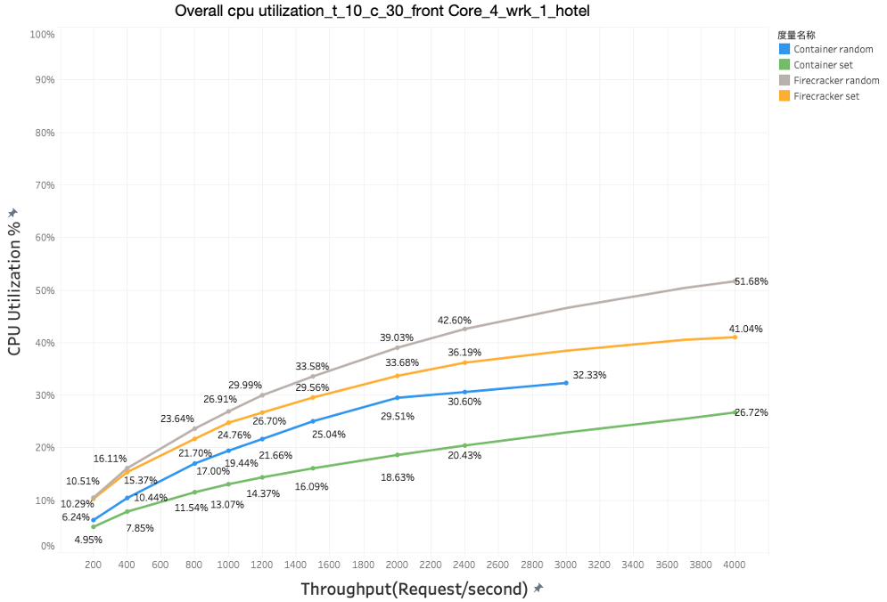
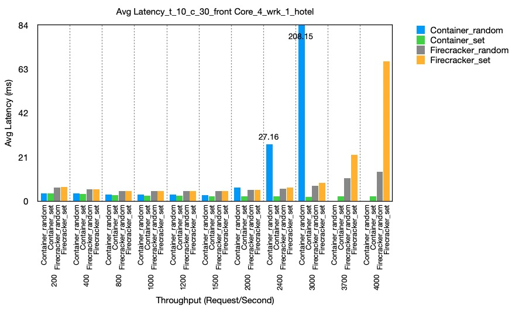
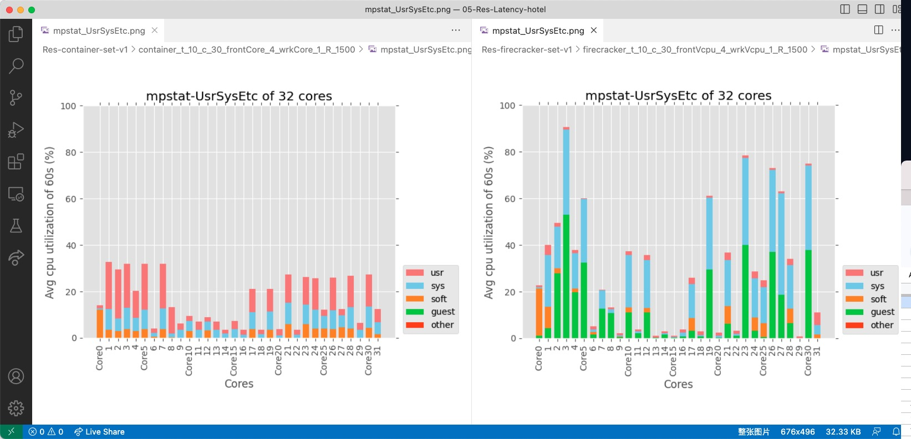

# Hotel Reservation Data

let 13 firecrackers, each set to different cores, from core 0,2,4,6,8…….20

set frontend to core 1 or above (basically core 1,3,5-more-15)

set wrk to core 31

This time not set to specific cores, just limit the number of cores!!

## Overall CPU Excel
Can see the overall CPU utilization, throughtput, BW etc. in this excel [05 - Latency of HotelReservation](https://docs.google.com/spreadsheets/d/1g6xG4EhbOI9c9EL50p4-9w67Qtwz7rMt7fDnTvXlExA/edit#gid=0).

## Overall Cpu Utilization
Overall cpu utilization comparison,under the condition: t_10_c_30_frontCore_4_wrk_1, different -R, according to the data in the upper excel [05 - Latency of HotelReservation](https://docs.google.com/spreadsheets/d/1g6xG4EhbOI9c9EL50p4-9w67Qtwz7rMt7fDnTvXlExA/edit#gid=0)

## Avg Latency
Avg Latency comparison,under the condition: t_10_c_30_frontCore_4_wrk_1, dirrerent -R, according to the data in the upper excel [05 - Latency of HotelReservation](https://docs.google.com/spreadsheets/d/1g6xG4EhbOI9c9EL50p4-9w67Qtwz7rMt7fDnTvXlExA/edit#gid=0)

## Mpstat-UsrSysEtc
The mpstat result,under the condition: t_10_c_30_frontCore_4_wrk_1, -R 1500, compare the UsrSysEtc result of "container set" and "firecracker set"

## VMs - Corresponding cores
* consul \ -—-—----------------—------------------ core 0
* hotel-reserv-geo \ —---------------------------- core 2
* hotel-reserv-recommendation \ -——-—------------- core 4
* hotel-reserv-user \ —-------------—------------- core 6
* hotel-reserv-jaeger \ ----------—--------------- core 8
* hotel-reserv-rate-mmc \ ---------—-------------- core 10
* hotel-reserv-profile-mmc \ ----------—---------- core 12
* hotel-reserv-geo-mongo \ ----------—------------ core 14
* hotel-reserv-profile-mongo \ ------------------- core 16
* hotel-reserv-rate-mongo \ -----------—---------- core 18
* hotel-reserv-recommendation-mongo -------------- core 20
* hotel-reserv-user-mongo  ----------------------- core 22

* hotel-reserv-profile ---—----------------------- core 24, 26
* hotel-reserv-search --—------------------------- core 28, 30

* hotel-reserv-reservation-mongo \ --------------- core 9, 11, 13, 15(这个本来只需要一个core，而且本身cpu利用率非常少，是和别的叠在一起的，但是两个机子container swarm random的时候会挂掉，所以给4个core)
* Hotel-reserv-rate —----------------------------- core 17, 19
* hotel-reserv-reservation —---------------------- core 21, 23
* hotel-reserv-reservation-mmc —---—---------------core 25, 27

* hotel-frontend --------------------------------------- core 1, 3, 5, 7

## Generation Scrpts：
* test-CPU-randomCore-grayfox-latency-firecracker
* test-CPU-oddEvenCore-grayfox-latency-firecracker