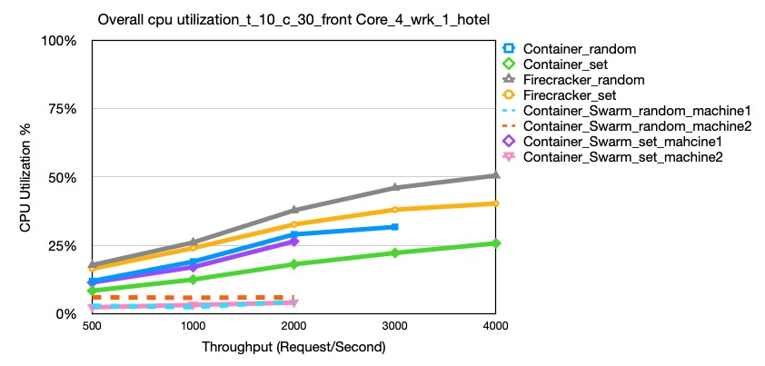
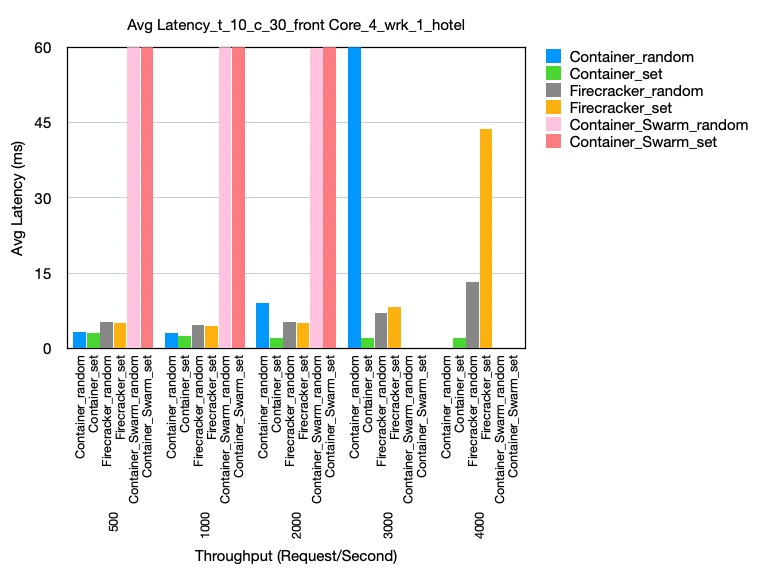
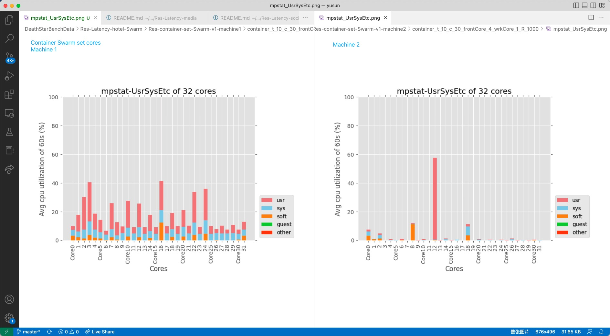

# Hotel Reservation Data - Swarm

let 18 firecrackers, each set to different cores, from core 0,2,4,6,8…….20

set frontend to core 1 or above (basically core 1,3,5-more-15)

set wrk to core 31

Notice Container random Swarm didn't get wanted request/second!!!

Only Container set Swarm get wanted request/second in pic. (get request/second (-R) from 100 - 2000)

## Overall CPU Excel
Can see the overall CPU utilization, throughtput, BW etc. in this excel [Latency of HotelReservation Swarm](https://docs.google.com/spreadsheets/d/1SAPFEOHZ8QP8jzDtzEEULMyZjnnBidJd21M3Xt4HAz8/edit#gid=1045338351).

## Overall Cpu Utilization
Overall cpu utilization comparison,under the condition: t_10_c_30_frontCore_4_wrk_1, different -R, according to the data in the upper excel [Latency of HotelReservation Swarm](https://docs.google.com/spreadsheets/d/1SAPFEOHZ8QP8jzDtzEEULMyZjnnBidJd21M3Xt4HAz8/edit#gid=1045338351)

## Avg Latency
Avg Latency comparison,under the condition: t_10_c_30_frontCore_4_wrk_1, dirrerent -R, according to the data in the upper excel [Latency of HotelReservation Swarm](https://docs.google.com/spreadsheets/d/1SAPFEOHZ8QP8jzDtzEEULMyZjnnBidJd21M3Xt4HAz8/edit#gid=1045338351)

## Mpstat-UsrSysEtc
The mpstat result,under the condition: t_10_c_30_frontCore_4_wrk_1, -R 1000, compare the UsrSysEtc result of "container set" in machine 1 and machine 2

## VMs - Corresponding cores, master machine
* consul \ -—-—----------------—------------------ core 0
* hotel-reserv-geo \ —---------------------------- core 2
* hotel-reserv-recommendation \ -——-—------------- core 4
* hotel-reserv-user \ —-------------—------------- core 6
* hotel-reserv-jaeger \ ----------—--------------- core 8

* hotel-reserv-profile ---—----------------------- core 10, 12
* hotel-reserv-search --—------------------------- core 14, 16
* Hotel-reserv-rate —----------------------------- core 18, 20
* hotel-reserv-reservation —---------------------- core 22, 24

## VMs - Corresponding cores, secondary machine
* hotel-reserv-rate-mmc \ ---------—-------------- core 0
* hotel-reserv-profile-mmc \ ----------—---------- core 2
* hotel-reserv-geo-mongo \ ----------—------------ core 4
* hotel-reserv-profile-mongo \ ------------------- core 6
* hotel-reserv-rate-mongo \ -----------—---------- core 8
* hotel-reserv-recommendation-mongo -------------- core 10

* hotel-reserv-reservation-mongo \ --------------- core 12
* hotel-reserv-user-mongo  ----------------------- core 14

* hotel-reserv-reservation-mmc —---—---------------core 16, 18

## Generation Scrpts：
* test-CPU-randomCore-grayfox-latency-firecracker-swarm
* test-CPU-oddEvenCore-grayfox-latency-firecracker-swarm

## Data
* Res-container-set-Swarm-v1
* Res-container-random-Swarm-v1

## Difference of Swarm and non-Swarm
* Swarm mode set vms to 2 machines / ori container test only on one machine
* Swarm don't have vms set to one same core 
* Swam record the BW of the physical network card 