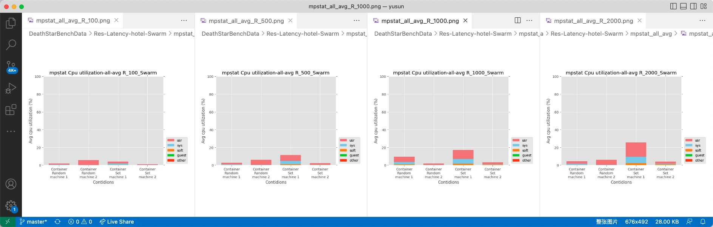

# Avg Latency
Some comparison

Notice Container random Swarm didn't get wanted request/second.

Only Container set Swarm get wanted request/second in pic. (get request/second (-R) from 100 - 2000)

