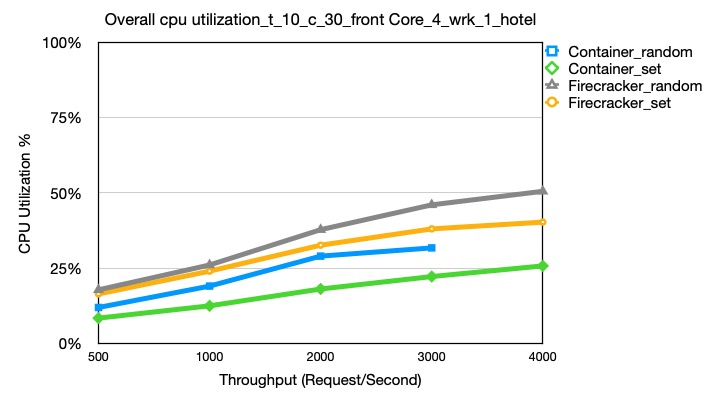

# Hotel Reservation Data

let 13 firecrackers, each set to different cores, from core 0,2,4,6,8…….20

set frontend to core 1 or above (basically core 1,3,5-more-15)

set wrk to core 31, or 31, 29

## Overall CPU Excel
Can see the overall CPU utilization, throughtput, BW etc. in this excel [Latency of HotelReservation](https://docs.google.com/spreadsheets/d/1SAPFEOHZ8QP8jzDtzEEULMyZjnnBidJd21M3Xt4HAz8/edit#gid=0).

## Overall Cpu Utilization
Overall cpu utilization comparison,under the condition: t_10_c_30_frontCore_4_wrk_1, different -R, according to the data in the upper excel [Latency of HotelReservation](https://docs.google.com/spreadsheets/d/1SAPFEOHZ8QP8jzDtzEEULMyZjnnBidJd21M3Xt4HAz8/edit#gid=0)

## Avg Latency
Avg Latency comparison,under the condition: t_10_c_30_frontCore_4_wrk_1, firrerent -R, according to the data in the upper excel [Latency of HotelReservation](https://docs.google.com/spreadsheets/d/1SAPFEOHZ8QP8jzDtzEEULMyZjnnBidJd21M3Xt4HAz8/edit#gid=0)

## VMs - Corresponding cores
* consul \ -—-—----------------—------------------ core 0
* hotel-reserv-geo \ —---------------------------- core 2
* hotel-reserv-recommendation \ -——-—------------- core 4
* hotel-reserv-user \ —-------------—------------- core 6
* hotel-reserv-jaeger \ ----------—--------------- core 8
* hotel-reserv-rate-mmc \ ---------—-------------- core 10
* hotel-reserv-profile-mmc \ ----------—---------- core 12
* hotel-reserv-geo-mongo \ ----------—------------ core 14
* hotel-reserv-profile-mongo \ ------------------- core 16
* hotel-reserv-rate-mongo \ -----------—---------- core 18
* hotel-reserv-recommendation-mongo -------------- core 20

* hotel-reserv-reservation-mongo \ --------------- core 20
* hotel-reserv-user-mongo  ----------------------- core 20

* hotel-reserv-profile ---—----------------------- core 22, 24
* hotel-reserv-search --—------------------------- core 26, 28
* Hotel-reserv-rate —----------------------------- core 17, 19
* hotel-reserv-reservation —---------------------- core 21, 23
* hotel-reserv-reservation-mmc —---—---------------core 25, 27

## Generation Scrpts：
* test-CPU-randomCore-grayfox-firecracker
* test-CPU-oddEvenCore-grayfox-firecracker

# Data to use:
grayfox /root/yu/Res-Latency-hotel