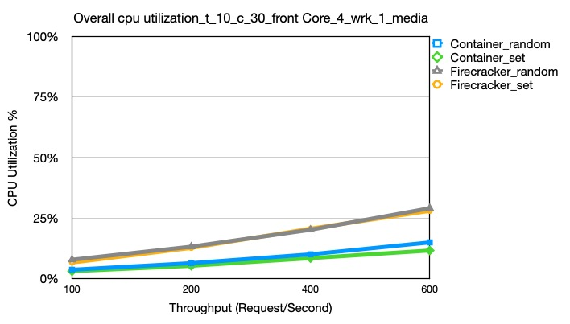
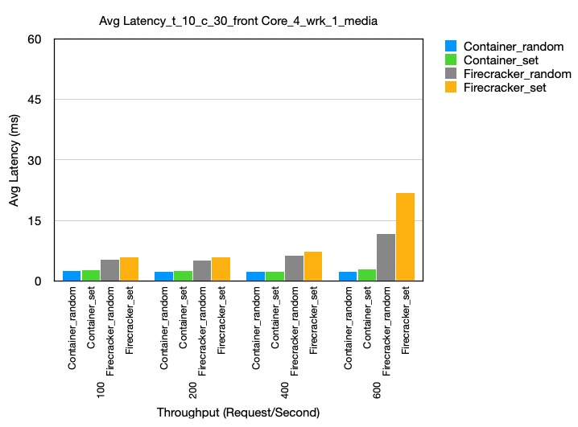

# Media Microservices Latency Data
# Set core
Total 33 containers, 32 firecrackers

let 30 firecrackers, each set to different one core, from core 0,2,4,6,8…….30 AND 17, 19, 21

let firecracker media-microservice-compose-review-memcached set to core 23, 25

set social-network-compose-post-service to core 1, 3, 5, 7

set wrk to core 31

If it is container, the container mediamicroservices-dns-media-1 set to core 27

## Overall CPU Excel
Can see the overall CPU utilization, throughtput, BW etc. in this excel [Latency of MediaMicroservices-v2](https://docs.google.com/spreadsheets/d/1txM9NYG8rz_om3YJ5dDuTJvDBDU834C_kWSyyIDq0G4/edit#gid=371584864).

## Overall Cpu Utilization
Overall cpu utilization comparison,under the condition: t_10_c_30_frontCore_4_wrk_1, different -R, according to the data in the upper excel [Latency of MediaMicroservices-v2](https://docs.google.com/spreadsheets/d/1txM9NYG8rz_om3YJ5dDuTJvDBDU834C_kWSyyIDq0G4/edit#gid=371584864)

## Avg Latency
Avg Latency comparison,under the condition: t_10_c_30_frontCore_4_wrk_1, firrerent -R, according to the data in the upper excel [Latency of MediaMicroservices-v2](https://docs.google.com/spreadsheets/d/1txM9NYG8rz_om3YJ5dDuTJvDBDU834C_kWSyyIDq0G4/edit#gid=371584864)

## VMs - Corresponding cores
* media-microservice-review-storage-mongodb \ -—-—----------------—-- core 0
* media-microservice-user-review-mongodb \ -—-—----------------—----- core 2
* media-microservice-movie-review-mongodb \ -—-—----------------—---- core 4
* media-microservice-unique-id-service \ -—-—------------------------ core 6
* media-microservice-text-service \ -—-—----------------—------------ core 8
* media-microservice-rating-service \ -—-—----------------—---------- core 10
* media-microservice-user-service \ -—-—----------------—------------ core 12
* media-microservice-review-storage-service \ -—-—------------------- core 14
* media-microservice-user-review-service \ -—-—---------------------- core 16
* media-microservice-movie-review-service \ -—-—--------------------- core 18

* media-microservice-rating-redis \ -—-—----------------—------------ core 20
* media-microservice-movie-review-redis \ -—-—----------------—------ core 20
* media-microservice-user-review-redis \ -—-—------------------------ core 20

* media-microservice-movie-id-memcached \ -—-—----------------—------ core 22 (后加的)
* media-microservice-user-memcached \ -—-—-----------------—--------- core 22 (后加的)
* media-microservice-review-storage-memcached  -—-—------------------ core 22
* media-microservice-cast-info-memcached  -—-—----------------—------ core 22
* media-microservice-plot-memcached  -—-—---------—------------------ core 22
* media-microservice-movie-info-memcached  -—-—----------------—----- core 22
* media-microservice-movie-id-mongodb  -—-—-------------------------- core 22
* media-microservice-user-mongodb  -—-—-----------—------------------ core 22
* media-microservice-cast-info-mongodb  -—-—------------------------- core 22
* media-microservice-plot-mongodb  -—-—----------------—------------- core 22
* media-microservice-movie-info-mongodb  -—-—------------------------ core 22
* media-microservice-cast-info-service  -—-—------------------------- core 22
* media-microservice-plot-service  -—-—----------------—------------- core 22
* media-microservice-movie-info-service  -—-—------------------------ core 22

* media-microservice-nginx-web-server \ -—-—------—------------------ core 24(没法给多，会崩溃,/core给24， 26能跑28秒左右)

* media-microservice-jaeger \ -—-—----------------—------------------ core 13,15（R-800隔一段时间会很多，改成2个了，其实R小的话，不用那么多）
* media-microservice-movie-id-service \ -—-—------------------------- core 17,19

* media-microservice-compose-review-memcached \ -—-—---------—------- core 21,23,25,27
* media-microservice-compose-review-service \ -—-—------------------- core 1, 3, 5, -more- 7

* container mediamicroservices-dns-media-1 -—-—---------------------- core 11

core 26,28,30, 9,11，是空的,container多一个dns-media-1占core 11

## There is little different from set cores
- Container has 33 vms(container mediamicroservices-dns-media-1), firecracker has 32 vms

## Generation Scrpts：
* test-CPU-randomCore-grayfox-latency-firecracker
* test-CPU-oddEvenCore-grayfox-latency-firecracker
* Command out the line contains `runPerf.sh`

# Data to use:
grayfox /root/yu/Res-Latency-media-v2